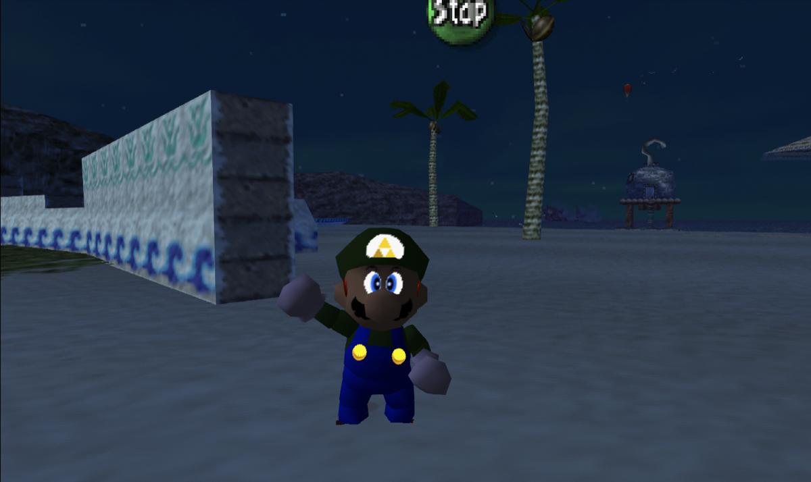
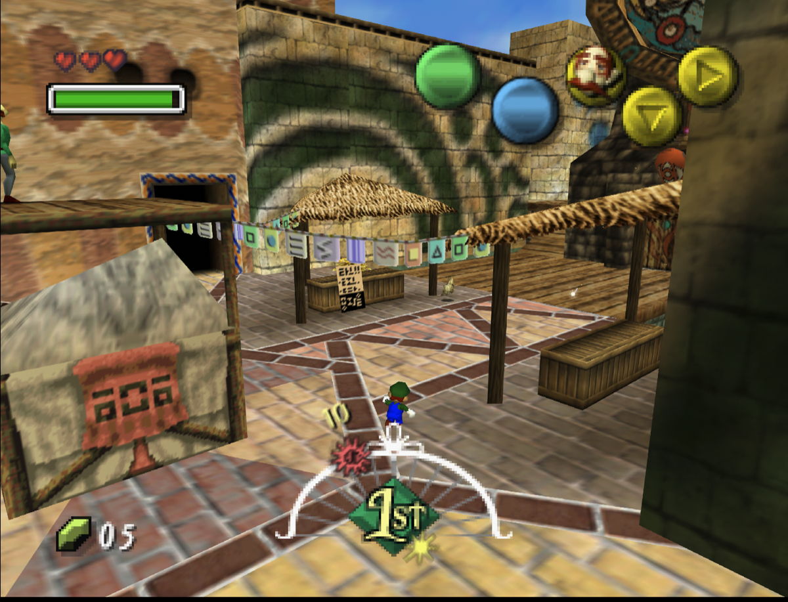
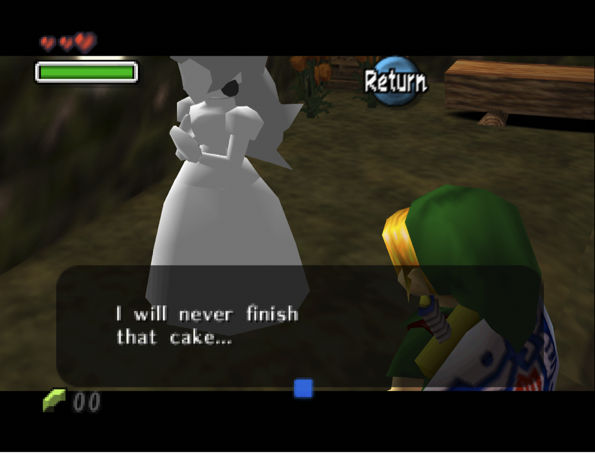
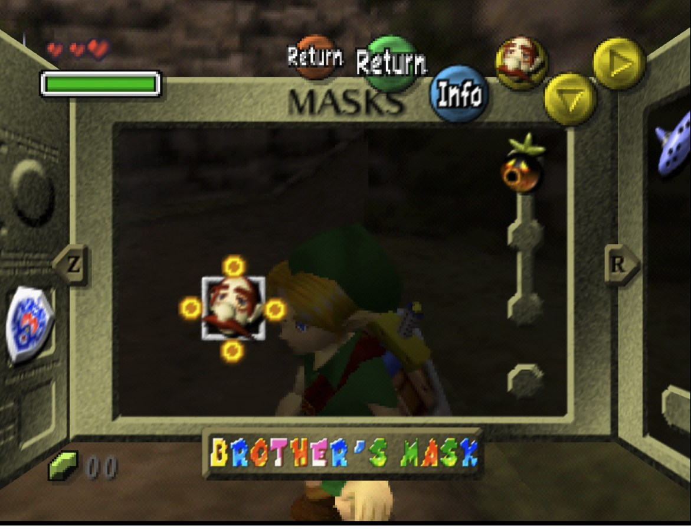
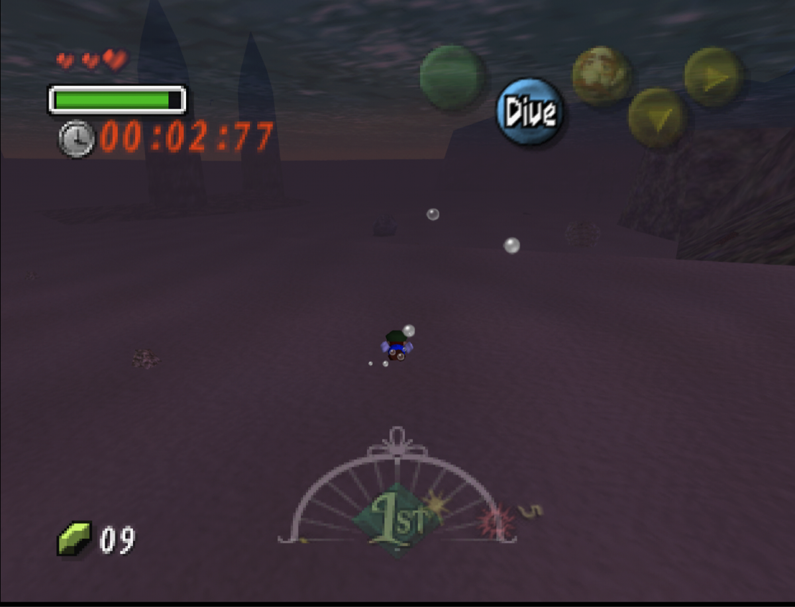

# Mario's Mask

**Play *Majora's Mask* as Mario.**

Mario's Mask brings Mario's movement, attacks, voice, and animations from
*Super Mario 64* into the world of *Majora's Mask*.

**[Download Mario's Mask](https://github.com/msmfai/marios-mask/releases)**

> **Early alpha:** back up your saves and expect a few rough edges.

## Explore Termina as Mario

The Brother's Mask contains the spirit of a hero from another world. Find the stone
Peach in the Laundry Pool and play the Song of Healing nearby to receive it.

Put on the mask and Mario can run, punch, ground-pound, long-jump, triple-jump,
wall-jump, swim, and explore the rest of *Majora's Mask*.

## Build your game

Bring your own **USA Nintendo 64 versions** of *Super Mario 64* and
*Majora's Mask*. The builder combines them locally on your computer.

1. [Open the Releases page](https://github.com/msmfai/marios-mask/releases).
2. Under **Assets**, download **MariosMaskBuilder** for Windows, macOS, or Linux.
3. Extract it and open **MariosMaskBuilder**.
4. Choose both of your game files and where to save the result.
5. Click **Build Mario's Mask**.
6. Open the new `Marios-Mask.z64` in an N64 emulator or flash cart.

Raw `.z64`, `.v64`, and `.n64` files work, along with `.zip` and `.gz` archives.
The small standalone builder works entirely on your computer.

## Start playing

With fresh save data, File 1 starts as `Link` at the beginning of Day 1, just after
the opening tutorial. File 2 begins a completely new game.

Having trouble opening the builder?

- **Mac:** Control-click it, choose **Open**, then choose **Open** again.
- **Windows:** Choose **More info**, then **Run anyway** if SmartScreen appears.
- **Linux:** Extract the whole archive before opening it.

Found a bug? [Tell us what happened](https://github.com/msmfai/marios-mask/issues/new/choose)
and keep both game files private.

Mario's Mask is free software released under [GPL-3.0](LICENSE).
